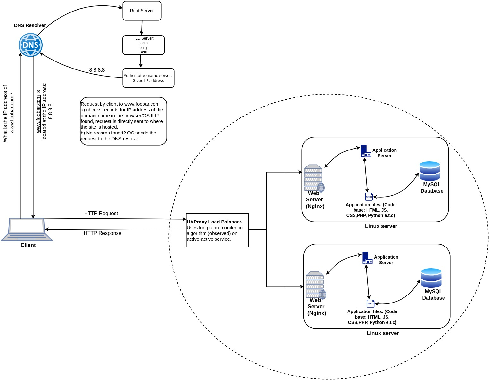

# Distributed Web Infrastructure

## Description

This is a distributed web infrastructure that atttempts to reduce the traffic to the primary server by distributing some of the load to a replica server with the aid of a server responsible for balancing the load between the two servers (primary and replica).

## Specifics About This Infrastructure

+ The distribution algorithm the load balancer is configured with and how it works.
The HAProxy load balancer is configured with the *Long Term Resource Monitoring (Observed).* distribution algorithm. This algorithm uses a combination of the logic used in the Least Connections and Fastest algorithms to load balance connections to servers being load-balanced. With this method, servers are ranked based on a combination of the number of current connections and the response time. Servers that have a better balance of fewest connections and fastest response time receive a greater proportion of the connections. The downside of this Application Delivery Controller method is that it is rarely available in a simple load balancer.
+ The setup enabled by the load-balancer.
The HAProxy load-balancer is enabling an *Active-Active* setup rather than an *Active-Passive* setup. In an *Active-Active* setup, the load balancer distributes workloads across all nodes in order to prevent any single node from getting overloaded. Because there are more nodes available to serve, there will also be a marked improvement in throughput and response times. If one active instance fails an agent shuts it down and all the process transferred to the other active instance. On the other hand, in an *Active-Passive* setup, not all nodes are going to be active (capable of receiving workloads at all times). In the case of two nodes, for example, if the first node is already active, the second node must be passive or on standby. The second or the next passive node can become an active node if the preceding node is inactive.
+ How a database *Primary-Replica* (*Master-Slave*) cluster works.
A *Primary-Replica* setup configures one server to act as the *Primary* server and the other server to act as a *Replica* of the *Primary* server. However, the *Primary* server is capable of performing read/write requests whilst the *Replica* server is only capable of performing read requests. Data is synchronized between the *Primary* and *Replica* servers whenever the *Primary* server executes a write operation.
+ The difference between the *Primary* node and the *Replica* node in regard to the application.
The *Primary* node is responsible for all the write operations the site needs whilst the *Replica* node is capable of processing read operations, which decreases the read traffic to the *Primary* node.

## Issues With This Infrastructure

+ There are multiple SPOF (Single Point Of Failure).
For example, if the Primary MySQL database server is down, the entire site would be unable to make changes to the site (including adding or removing users). The server containing the load balancer and the application server connecting to the primary database server are also SPOFs.
+ Security issues.
The data transmitted over the network isn't encrypted using an SSL certificate so hackers can spy on the network. There is no way of blocking unauthorized IPs since there's no firewall installed on any server.
+ No monitoring.
There is no way of knowing the status of each server since they're not being monitored.
